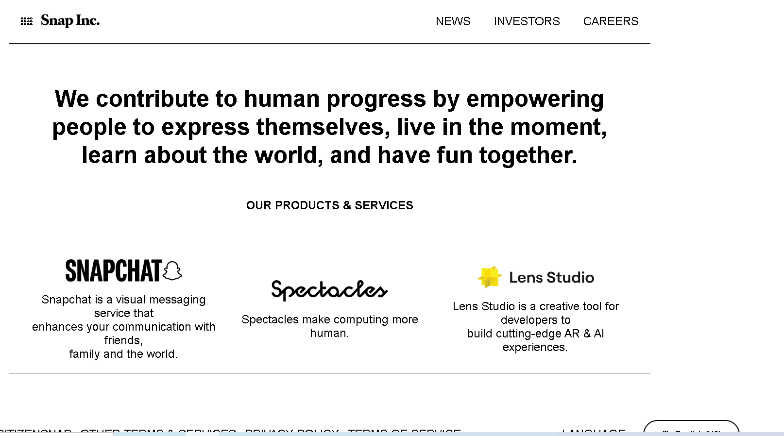
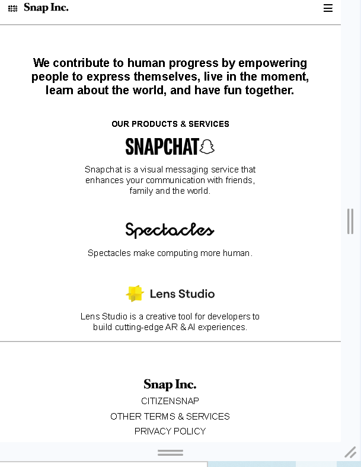

# 📸 Snap Landing Page

A modern, responsive landing page inspired by Snap Inc.  
Built to practice clean UI design, layout structure, and responsive front-end development.

---

## 🚀 Live Demo
🔗 [View Live Project](https://snap-inc.vercel.app/)

---

## 📂 GitHub Repository
🔗 [View Source Code](https://github.com/M-gatwiri/snap-inc)

---

## ✨ Features
- Responsive design (mobile + desktop)
- Modern landing page layout
- Clean UI structure
- Navigation header with logo
- Styled buttons and sections
- Optimized layout using Flexbox

---

## 🛠️ Built With
- HTML5
- CSS3
- Flexbox
- Google Fonts
- Font Awesome 

---

## 📸 Screenshots


_

```md




## ⚙️ Installation & Usage

### 1️⃣ Clone the repository
```bash
git clone https://github.com/M-gatwiri/snap-inc.git

~~~

## Navigate into the project folder

```bash
cd snap-inc

~~~

## 📁 Project Structure
snap-inc/
│
├── index.html # Main HTML file
├── style.css # CSS styling
├── images/ # Folder containing all images and assets
└── README.md # Project documentation


---

## 🎯 Learning Goals
- Practice building a real-world landing page
- Improve CSS layout and responsiveness
- Strengthen front-end UI design skills
- Organize project structure for maintainability
- Deploy a live project to the web

## 👩🏽‍💻 Author

**Mercy Gatwiri**

- GitHub: [https://github.com/M-gatwiri](https://github.com/M-gatwiri)  
- LinkedIn: [https://www.linkedin.com/in/mercy-gatwiri-17454b228](https://www.linkedin.com/in/mercy-gatwiri-17454b228)


